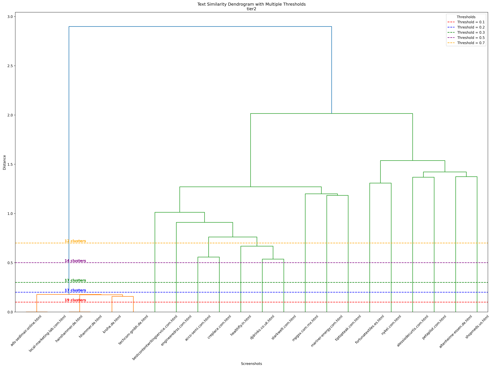

# HTML-Similarity

## Overview

The **HTML-Similarity** project focuses on grouping similar HTML documents based on their content and visual appearance. The task is to design an algorithm that can group together HTML documents from four subdirectories (`tier1`, `tier2`, `tier3`, `tier4`) of increasing complexity.

The approach combines both **textual** and **visual** similarity measures to identify similar web pages from the perspective of a user viewing them in a browser.


**The main goals are:**
1. To group HTML documents based on textual content similarity.
2. To group HTML documents based on visual similarity derived from screenshots.
3. To compare and analyze the performance of both methods and propose a combined approach.

## Approach

### 1. **Textual Analysis**:
The textual content of each HTML page is extracted using **BeautifulSoup** to parse and clean the HTML. We then apply **TF-IDF** (Term Frequency-Inverse Document Frequency) to convert the text into a numerical representation. This enables us to compute the cosine similarity between the pages. We use **Agglomerative Clustering** to group the documents based on textual similarity.

### 2. **Visual Analysis**:
Screenshots of each HTML page are captured using **Selenium** in headless mode. We perform visual similarity analysis using two methods:
   - **CLIP-based Features**: A pre-trained CLIP model is used to extract high-dimensional visual features from the screenshots, and **Agglomerative Clustering** groups them based on these features.
   - **Image Hashing**: A simpler method where images are converted into hash values, and the visual similarity is computed by comparing the hashes.
I've also tried using **ResNet101** but i've found that Clip was giving the same results with less complexity.

### 3. **Clustering**:
Both the textual and visual clustering results are compared. The final goal is to explore how these clustering methods align and provide a strategy for combining them.

---

## Directory Structure

```
├── clones/                      # Directory containing HTML documents organized in 4 subdirectories
│   ├── tier1/
│   ├── tier2/
│   ├── tier3/
│   ├── tier4/
├── screenshots/                 # Directory to store screenshots of HTML pages organized in 4 subdirectories
│   ├── tier1/
│   ├── tier2/
│   ├── tier3/
│   ├── tier4/
├── capture_screenshots.py       # Script to capture screenshots of HTML pages using Selenium
├── html_text_compare.py         # Script for text-based similarity comparison using TF-IDF and Agglomerative Clustering
├── html_visual_analyzer.py      # Script for visual similarity analysis using CLIP and Image Hashing
├── html_image_hash.py           # Script for visual similarity analysis using Image Hashing
├── ensemble_clustering.py       # Script to combine text-based and visual clustering results
├── README.md
├── text_based_plots/
├── clip_plots/
├── hash_plots/
├── ensemble_plots/
├── clustering_results.txt       # Output file containing the clustering results
└── requirements.txt
```

---

## Requirements

Install the required Python packages listed in the `requirements.txt` file using the following command:

```bash
pip install -r requirements.txt
```

---

## Usage

1. **Capturing Screenshots**: 
   - Run `capture_screenshots.py` to capture screenshots of the HTML documents in the `clones` directory.
   
2. **Text-based Clustering**: 
   - Run `html_text_compare.py` to process the HTML documents, compute the textual similarity, and group similar documents based on TF-IDF vectors.

3. **Visual Clustering**:
   - Run `html_visual_analyzer.py` to process the captured screenshots and group similar documents based on their visual features using CLIP or image hashing.
   - Run `html_image_hash.py` to perform visual clustering using image hashing.

4. **Ensemble Clustering**:
   - Combine the results from the text-based and visual clustering methods to propose a combined approach.

5. **Output**:
   - The output is saved in the `clustering_results.txt` file.

---

## Plot Comparisons

<div style="display: flex; flex-wrap: wrap; justify-content: center;">
    
    
    
    
</div>

The provided set of heatmaps compares the similarity matrices across three models (Text, Hash, and Visual) and their combined version. Here's a breakdown of each matrix and the insights we can draw:

#### **1. Text Similarity Matrix (Top Left)**:
- **Purpose**: This matrix captures the similarity between HTML documents based on text analysis. It uses measures like **TF-IDF** or **Cosine Similarity** to determine how similar the textual content of the documents is.
- **Insights**: 
  - Some blocks of documents are highly similar, indicating that the text content of these pages is nearly identical.
  - The matrix shows high similarity between certain websites, suggesting they share common textual content.
  - However, there are a significant number of entries with low similarity, suggesting that not all sites share the same type of content.

#### **2. Visual Similarity Matrix (Top Right)**:
- **Purpose**: This matrix measures similarity based on the visual content of the sites (screenshots). It likely uses methods such as **image hashing** or **CLIP-based embedding**.
- **Insights**:
  - Visual similarity is evident in clusters where certain websites exhibit similar layout or design characteristics.
  - There is a high concentration of similar blocks that indicate sites with matching styles, colors, or other visual elements.
  - Unlike text, the visual similarity matrix shows stronger clustering of similar websites based on their design, indicating common templates or branding across certain groups.

#### **3. Hash Similarity Matrix (Bottom Left)**:
- **Purpose**: This matrix is based on the hash values of images (screenshots). It likely uses **perceptual hash functions** like **average hash** or **dct** to quantify image similarity.
- **Insights**:
  - There are smaller, more localized blocks of high similarity, indicating that certain sites share identical or highly similar images.
  - Some clusters appear to have very strong similarity (values closer to 1), indicating that those websites use identical images or closely related visual components.

#### **4. Combined Similarity Matrix (Bottom Right)**:
- **Purpose**: This matrix is a combination of the previous three matrices (Text, Hash, Visual). It integrates the results by using a **weighted average** or a similar method.
- **Insights**:
  - The combined matrix clearly highlights websites that are consistently similar across all models (text, hash, and visual).
  - There is a stark difference between low and high similarity regions. The matrix reveals that the combination of text, visual, and hash features significantly boosts the clustering of similar sites.
  - **Sparse but High-Confidence Similarities**: Some areas are very dense, showing that the ensemble model has high confidence about similarities between those websites, likely due to agreement from multiple models.
  - The **pattern consistency** of the matrix suggests that the ensemble approach is successfully identifying clusters that would be hard to spot using only one model.

<div style="display: flex; flex-wrap: wrap; justify-content: center;">
    
    
    
</div>

The dendrogram shows the hierarchical clustering of the documents based on the similarity matrix.

---

## Future Improvements

- Use a more complex model for the visual analysis.
- Currently the ensemble clustering is having a hard time to normalize the similarity matrix.

## Conclusion

This project provides a dual approach to grouping HTML documents based on content and visual appearance. The combination of both textual and visual features allows for an effective solution to the problem. The results are easily interpretable, and the methodology can be applied to larger, more complex datasets with further optimizations.